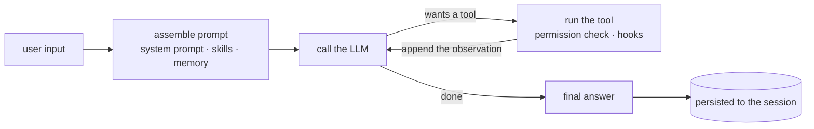

# AIMON Documentation

**AIMON is a ReAct framework for running LLM agents inside a Java application.** You hand the model
a set of tools, and AIMON runs the loop for you — reason, act, observe.

If this is your first visit, this page is enough. What it is, how to run it, what it is made of, and
where to go next, in that order.

| In a hurry | Go straight to |
|--------|------|
| I just want to run something | [2. Running it in five minutes](#2-running-it-in-five-minutes) |
| I want to skim what it can do | [Feature catalogue](overview/features.en.md) |
| I want to embed it in my application | [Embedding guide](getting-started/embedding-agent-in-application.en.md) |
| I want to write a new tool | [Tool development guide](features/tool/tool-development-guide.en.md) |

---

## 1. What AIMON is

Ask an LLM to "triage this alert" and the model **only answers**. To make it actually read the logs,
run a command, and reconsider in light of what came back, **something has to run the loop.** AIMON is
that loop.

Here is what you would build yourself, next to what AIMON does instead.

| Build it yourself | What AIMON gives you |
|---|---|
| LLM calls, tool-call parsing, retries, streaming | An `LlmClient` abstraction — OpenAI and Anthropic built in |
| Tools for reading, writing, searching files and running shell commands | A set of built-in tools plus the `Tool` extension point |
| Keeping conversation history, compacting it when the context fills | Session persistence and automatic compaction |
| Resuming a conversation across restarts and nodes | `SessionRecordStore` — Redis, PostgreSQL, MongoDB |
| Asking a human before a dangerous command runs | Tool permission rules and approval scopes |
| Stopping runaway loops and token burn | `ExecutionBudget` — iteration, token and time caps |
| Running someone else's commands somewhere isolated | Sandboxes — Docker, Kubernetes |

**What it does not do is just as clear.** It does not supply the model (the API key is yours), it does
not stand up infrastructure, and it has no UI. What lives outside the framework and what is mandatory
is listed in [`overview/context.en.md`](overview/context.en.md).

Operations automation — alert triage, root cause analysis, runbook execution — is what the defaults are
tuned for, but the core itself is domain-neutral.

---

## 2. Running it in five minutes

### Talk to the CLI

All you need is **Java 17** and **one LLM API key**.

```bash
git clone https://github.com/kangwoo/aimon-core.git
cd aimon-core
export OPENAI_KEY=sk-...          # or ANTHROPIC_API_KEY
./gradlew :aimon-cli:run
```

Once the REPL is up, just talk to it.

| Input | What it does |
|------|--------|
| Any sentence | Runs one turn (end a line with `\` for multi-line input) |
| `/help` | Lists the commands |
| `/status` · `/agents` · `/skills` | What is running and which tools it holds |
| `/compact` · `/clear` | Compacts or clears the conversation |
| `Ctrl+C` · `/quit` | Interrupts the current operation · exits |

### Embed it in your application

On Spring Boot, **three properties and one injection** are enough for a turn to run.

```yaml
aimon:
  workspace:
    root: /var/lib/aimon            # the working tree the agent reads and writes
  llm:
    api-key: ${ANTHROPIC_API_KEY}
  agent-defaults:
    default-agent: ops              # agents/ops/agent.md on the class path
```

```java
@Autowired
AimonSessions sessions;             // the one bean the starter expects you to inject

AgentExecutionResult result = sessions.submit(SessionId.of("user-42"), "check the disk usage");
String answer = result.getFinalAnswer();
```

Dependency coordinates, the property tree, streaming events and multi-instance deployment are all in the
[embedding guide](getting-started/embedding-agent-in-application.en.md). Non-Spring hosts use `AimonStack`
in §14 of that document; appendix A is for taking the whole assembly into your own hands.

To follow working integration code line by line,
[`aimon-core-integration-via-cli-reference.en.md`](getting-started/aimon-core-integration-via-cli-reference.en.md)
annotates the CLI bootstrap.

---

## 3. How it works

One **turn** — a single user input — runs this loop. One trip around the inner circle is an **iteration**.



The loop is not unbounded — `ExecutionBudget` caps iterations, tokens and time, and compaction folds the
history once the context fills up.

### Names worth knowing

| Name | What it is | How long it lives |
|------|---------|-------------|
| `Agent` | An **immutable definition** — name, system prompt, model, tool list (Markdown + YAML frontmatter) | Configuration |
| `AgentRuntime` | The execution environment that actually runs it — tool/hook registries, MCP connections | One per agent, living **across sessions** |
| `SessionRecord` | The **persistent** aggregate holding the conversation, identified by `SessionId` | Until deleted |
| `LiveSession` | The handle running turns against that session **on this node, right now** | Open until closed; dies with the process |
| `Tool` | The unit of interaction with the outside world. Never throws — returns a `ToolResult` | Stateless |
| `Skill` | A Markdown capability package bundling prompt, tools and hooks | A directory in the workspace |
| `Hook` | An intervention point at 13 lifecycle positions (`PreTool`, `OnStop`, …) | Registered at runtime |

IMPORTANT: two pairs are easy to confuse, and this project separates them **by name**.

- **Session ≠ live session** — one `SessionRecord` may have zero `LiveSession`s, or several. Anything that
  must survive a restart belongs on the record.
- **Turn ≠ iteration ≠ execution** — a turn processes one input, an iteration is one trip around the loop,
  and an execution is any agent run, possibly without a session at all (subagent forks, scheduled routines).

Both distinctions are set out in full in [`overview/glossary.en.md`](overview/glossary.en.md) and
[`overview/scope-model.en.md`](overview/scope-model.en.md). If you are wondering where a value belongs or
when to `close()` it, the latter answers that.

---

## 4. What it is made of

A multi-module Gradle project. **The framework itself is one module, `aimon-core`**; everything else is
opt-in — the core holds interfaces and the implementations live outside it.

| Layer | Modules | What you get |
|----|------|--------|
| **Core** | `aimon-core` | Execution engine, tools, skills, hooks, memory, session SPIs, virtual filesystem |
| **Assembly** | `aimon-bootstrap` · `aimon-spring-boot-starter` · `aimon-bom` | Wiring and teardown order done for you |
| **LLM** | `aimon-llm-openai` · `aimon-llm-anthropic` | The actual model calls (you need one of them) |
| **Session storage** | `aimon-session-{redis,postgres,mongodb}` · `aimon-session-routing` | Persistence and multi-node routing |
| **Execution environments** | `aimon-sandbox{,-docker,-kubernetes}` · `aimon-browser-playwright` | Isolated shells, web automation |
| **Storage / retrieval** | `aimon-filesystem-{gridfs,s3}` · `aimon-knowledge-opensearch` | VFS backends, RAG |
| **Everything else** | `aimon-scheduling-quartz` · `aimon-workflow-graaljs` · `aimon-rewake-webhook` | Distributed cron, JS workflows, async wake-up |
| **Reference app** | `aimon-cli` | A REPL with the whole framework wired up (not published) |

Coordinates and a description per module are in the [repository README](../README.md); "is there something
for X?" is answered by the [feature catalogue](overview/features.en.md) across 17 areas. The interface
reference is [`overview/architecture.en.md`](overview/architecture.en.md), and what runs where once you
deploy on several nodes is [`overview/deployment.en.md`](overview/deployment.en.md).

---

## 5. What to read next

| What you are doing | Document |
|-----------|------|
| **Skimming what exists** | [`overview/features.en.md`](overview/features.en.md) — entry points and required modules in one table |
| Understanding the core abstractions | [`overview/architecture.en.md`](overview/architecture.en.md) |
| Sorting out terms and lifetimes | [`overview/glossary.en.md`](overview/glossary.en.md) · [`overview/scope-model.en.md`](overview/scope-model.en.md) |
| Embedding it in your app | [`getting-started/embedding-agent-in-application.en.md`](getting-started/embedding-agent-in-application.en.md) |
| **Writing a new tool** | [`features/tool/tool-development-guide.en.md`](features/tool/tool-development-guide.en.md) |
| Teaching capabilities through skills | [`features/skill/builtin-agent-skill-guide.en.md`](features/skill/builtin-agent-skill-guide.en.md) · [AgentSkills specification](references/agentskills-specification.md) |
| Intervening with hooks | [`features/hook/hook-development-guide.en.md`](features/hook/hook-development-guide.en.md) |
| Persisting conversations and running several nodes | [`features/session/agent-session-tutorial.en.md`](features/session/agent-session-tutorial.en.md) |
| Orchestrating subagents and workflows | [`features/subagent/subagent-development-guide.en.md`](features/subagent/subagent-development-guide.en.md) · [`features/workflow/workflow-usage-guide.en.md`](features/workflow/workflow-usage-guide.en.md) |
| Plugging in your own LLM provider | [`features/llm/llm-provider-development-guide.en.md`](features/llm/llm-provider-development-guide.en.md) |
| Finding what an upgrade broke | [`migration/rename-maps.md`](migration/rename-maps.md) — the old-name ↔ new-name lookup |
| Learning **why it is designed this way** | [`design/README.md`](design/README.md) |
| Seeing what `0.x` promises | [`project/api-stability.md`](project/api-stability.md) · [`project/roadmap.md`](project/roadmap.md) |

---

## 6. How the documentation is split

Documents are grouped **by what they are about, not by who reads them** (guide / development / operations).
Whoever attaches a feature usually reads both how to use it and how to extend it.

```
docs/
├── overview/          The whole picture — feature catalogue, architecture, boundary, deployment, terms, lifetimes
├── getting-started/   Attaching it for the first time — embedding, integration reference
├── features/          Per-feature detail — tools, skills, hooks, sessions, workflows, LLM, memory, knowledge, scheduling, observability
├── references/        External standards — AgentSkills, the hooks specification, the LLM Wiki pattern
├── design/            Design rationale and rejected alternatives (by domain, named like `features/`)
├── migration/         Upgrade procedures plus rename and frozen-name lookups
└── project/           Running the project — roadmap, compatibility promises, SOLID, documentation rules, releases
```

- Full per-feature index → [`features/README.en.md`](features/README.en.md)
- Design document index → [`design/README.md`](design/README.md)

`design/` records *why* things are the way they are, so a regular user does not need it. Go in only when
you need to know the internals or the reason something changed. Whether a design is implemented is stated
by the `Status` line at the top of each document.

**Korean is canonical here and English is the translation** (`*.en.md`). A document with no translation yet
is not a 404 under `/en/` — the Korean original is served in its place, so the site is always whole. The
rules for editing, moving and translating documents live in
[`project/documentation-guide.md`](project/documentation-guide.md).

---

## 7. Help and contributing

- Bugs and feature requests → [GitHub Issues](https://github.com/kangwoo/aimon-core/issues)
- How to contribute → [`CONTRIBUTING.md`](../CONTRIBUTING.md) ([Korean](../CONTRIBUTING.ko.md))
- Editing documentation → [`project/documentation-guide.md`](project/documentation-guide.md)
- Security vulnerabilities → [`SECURITY.md`](../SECURITY.md) (do not open an issue)
- Release notes → [`CHANGELOG.md`](../CHANGELOG.md)

> **Project status: `0.2.x`.** Until `1.0`, the public API may change across minor versions.
> What is promised and what is not is written down in [`project/api-stability.md`](project/api-stability.md).
