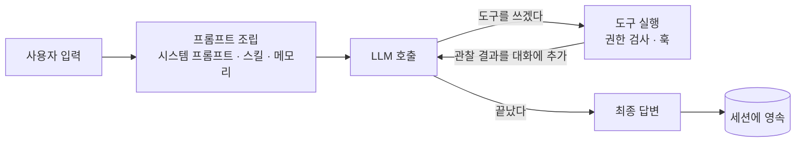

# AIMON 문서

**AIMON 은 자바 애플리케이션 안에서 LLM 에이전트를 돌리는 ReAct 프레임워크다.** 모델에게 도구를
쥐여 주고 — 생각하고(reason) · 도구를 쓰고(act) · 결과를 보는(observe) 루프를 대신 돌려 준다.

처음이라면 이 페이지만 읽어도 된다. 무엇인지 · 어떻게 돌려 보는지 · 무엇으로 이루어져 있는지 ·
그다음 어디로 갈지가 순서대로 있다.

| 급하면 | 바로 |
|--------|------|
| 일단 돌려 보고 싶다 | [2. 5분 만에 돌려보기](#2-5분-만에-돌려보기) |
| 무슨 기능이 있는지부터 훑고 싶다 | [기능 카탈로그](overview/features.md) |
| 내 애플리케이션에 붙이고 싶다 | [임베딩 가이드](getting-started/embedding-agent-in-application.md) |
| 새 도구를 만들고 싶다 | [도구 개발 가이드](features/tool/tool-development-guide.md) |

---

## 1. AIMON 이 무엇인가

LLM 에게 "이 알림 좀 분류해 줘" 라고 시키면 모델은 **답만** 한다. 로그를 실제로 읽고, 명령을
실행하고, 그 결과를 보고 다시 판단하게 하려면 누군가 **루프를 돌려야 한다.** AIMON 이 그 루프다.

직접 만들면 해야 하는 일과, AIMON 이 대신 하는 것을 나란히 놓으면 이렇다.

| 직접 만들면 | AIMON 이 주는 것 |
|---|---|
| LLM 호출, 도구 호출 파싱, 재시도, 스트리밍 | `LlmClient` 추상화 — OpenAI · Anthropic 내장 |
| 파일 읽기·쓰기·검색·셸 실행 같은 도구 | 내장 도구 한 벌 + `Tool` 확장점 |
| 대화 이력 보관, 컨텍스트 한도 초과 시 압축 | 세션 영속과 자동 컴팩션 |
| 재시작·멀티 노드를 넘어 대화 이어가기 | `SessionRecordStore` — Redis · PostgreSQL · MongoDB |
| 위험한 명령을 사람에게 물어보는 절차 | 도구 권한 규칙과 승인 스코프 |
| 무한 루프·토큰 폭주 막기 | `ExecutionBudget` — iteration · 토큰 · 시간 상한 |
| 격리된 곳에서 남의 명령 실행하기 | 샌드박스 — Docker · Kubernetes |

**하지 않는 것도 분명하다.** 모델을 제공하지 않고(API 키는 여러분 것이다), 인프라를 띄우지 않으며,
UI 도 없다. 무엇이 프레임워크 바깥에 있고 무엇이 필수인지는
[`overview/context.md`](overview/context.md) 가 목록으로 답한다.

운영 자동화(알림 분류 · 원인 분석 · 런북 실행)를 기본값으로 깔고 있지만, 코어 자체는 도메인 중립이다.

---

## 2. 5분 만에 돌려보기

### CLI 로 말 걸어 보기

필요한 것은 **Java 17** 과 **LLM API 키 하나**뿐이다.

```bash
git clone https://github.com/kangwoo/aimon-core.git
cd aimon-core
export OPENAI_KEY=sk-...          # 또는 ANTHROPIC_API_KEY
./gradlew :aimon-cli:run
```

REPL 이 뜨면 그냥 말을 걸면 된다.

| 입력 | 하는 일 |
|------|--------|
| 아무 문장 | 턴 하나를 돌린다 (줄 끝에 `\` 를 붙이면 여러 줄) |
| `/help` | 명령 목록 |
| `/status` · `/agents` · `/skills` | 지금 무엇이 떠 있고 무슨 도구를 들고 있는지 |
| `/compact` · `/clear` | 대화를 압축하거나 비운다 |
| `Ctrl+C` · `/quit` | 진행 중인 작업 중단 · 종료 |

### 내 애플리케이션에 붙이기

Spring Boot 라면 **프로퍼티 세 개와 주입 하나**로 턴이 돈다.

```yaml
aimon:
  workspace:
    root: /var/lib/aimon            # 에이전트가 읽고 쓸 작업 트리
  llm:
    api-key: ${ANTHROPIC_API_KEY}
  agent-defaults:
    default-agent: ops              # 클래스패스의 agents/ops/agent.md
```

```java
@Autowired
AimonSessions sessions;             // 스타터가 만들어 주는 유일한 빈

AgentExecutionResult result = sessions.submit(SessionId.of("user-42"), "디스크 사용률 좀 봐줘");
String answer = result.getFinalAnswer();
```

의존성 좌표 · 프로퍼티 트리 · 스트리밍 이벤트 · 멀티 인스턴스까지는
[임베딩 가이드](getting-started/embedding-agent-in-application.md) 에 있다. Spring 이 아닌 호스트는
같은 문서 §14 의 `AimonStack`, 조립 전체를 손으로 쥐고 싶으면 부록 A 다.

동작하는 통합 코드를 한 줄씩 따라가고 싶다면
[`aimon-core-integration-via-cli-reference.md`](getting-started/aimon-core-integration-via-cli-reference.md)
가 CLI 부트스트랩을 주석처럼 해설한다.

---

## 3. 어떻게 동작하는가

한 번의 **턴**(사용자 입력 1건)은 이 루프를 돈다. 안쪽 한 바퀴가 **iteration** 이다.



루프는 무한하지 않다 — `ExecutionBudget` 이 iteration · 토큰 · 시간에 상한을 걸고, 컨텍스트가 차면
컴팩션이 이력을 접는다.

### 알아 두면 좋은 이름

| 이름 | 무엇인가 | 얼마나 사는가 |
|------|---------|-------------|
| `Agent` | 이름 · 시스템 프롬프트 · 모델 · 도구 목록을 담은 **불변 정의** (Markdown + YAML frontmatter) | 설정값 |
| `AgentRuntime` | 그 정의를 실제로 굴리는 실행 환경 — 도구/훅 레지스트리, MCP 연결 | 에이전트당 하나, **여러 세션을 가로질러** 산다 |
| `SessionRecord` | 대화 이력을 담은 **영속** 애그리게이트. `SessionId` 로 식별 | 지울 때까지 |
| `LiveSession` | 그 세션에 대해 **지금 이 노드에서** 턴을 돌리는 핸들 | 열기 ~ 닫기, 프로세스와 함께 사라진다 |
| `Tool` | 에이전트가 외부와 상호작용하는 단위. 예외를 던지지 않고 `ToolResult` 를 돌려준다 | 무상태 |
| `Skill` | 프롬프트 · 도구 · 훅을 묶은 Markdown 능력 패키지 | 워크스페이스에 파일로 |
| `Hook` | 실행 라이프사이클 13개 지점의 개입점 (`PreTool`, `OnStop`, …) | 런타임에 등록 |

IMPORTANT: 헷갈리기 쉬운 두 쌍이 있고, 이 프로젝트는 그 둘을 **이름으로** 구분한다.

- **세션 ≠ 라이브 세션** — `SessionRecord` 하나에 `LiveSession` 은 0개일 수도, 여럿일 수도 있다.
  재시작을 넘어 살아남아야 하는 값은 레코드 쪽에 둔다.
- **턴 ≠ iteration ≠ execution** — 턴은 입력 1건의 처리, iteration 은 루프 한 바퀴, execution 은
  세션이 없을 수도 있는 실행 일반(서브에이전트 포크 · 스케줄 루틴).

두 구분의 전문은 [`overview/glossary.md`](overview/glossary.md) 와
[`overview/scope-model.md`](overview/scope-model.md) 에 있다. 값을 어디 두고 언제 `close()` 할지
고민된다면 후자가 답한다.

---

## 4. 무엇으로 이루어져 있는가

멀티 모듈 Gradle 프로젝트다. **프레임워크의 본체는 `aimon-core` 하나**이고, 나머지는 전부 opt-in 이다 —
코어는 인터페이스를 갖고 구현은 밖에 있다.

| 층 | 모듈 | 얻는 것 |
|----|------|--------|
| **코어** | `aimon-core` | 실행 엔진, 도구, 스킬, 훅, 메모리, 세션 SPI, 가상 파일시스템 |
| **조립** | `aimon-bootstrap` · `aimon-spring-boot-starter` · `aimon-bom` | 배선과 종료 순서를 대신 잡아 준다 |
| **LLM** | `aimon-llm-openai` · `aimon-llm-anthropic` | 실제 모델 호출 (하나는 반드시 필요) |
| **세션 저장** | `aimon-session-{redis,postgres,mongodb}` · `aimon-session-routing` | 영속과 멀티 노드 라우팅 |
| **실행 환경** | `aimon-sandbox{,-docker,-kubernetes}` · `aimon-browser-playwright` | 격리 셸, 웹 자동화 |
| **저장/검색** | `aimon-filesystem-{gridfs,s3}` · `aimon-knowledge-opensearch` | VFS 백엔드, RAG |
| **그 밖** | `aimon-scheduling-quartz` · `aimon-workflow-graaljs` · `aimon-rewake-webhook` | 분산 cron, JS 워크플로, 비동기 깨우기 |
| **참조 앱** | `aimon-cli` | 프레임워크를 다 배선해 둔 REPL (게시하지 않음) |

모듈 하나하나의 좌표와 설명은 [리포지토리 README](../README.md) 에, "이런 걸 하고 싶은데 있나?" 는
[기능 카탈로그](overview/features.md) 가 17개 영역으로 답한다. 인터페이스 레퍼런스는
[`overview/architecture.md`](overview/architecture.md), 여러 노드로 띄웠을 때 무엇이 어디에 뜨는지는
[`overview/deployment.md`](overview/deployment.md).

---

## 5. 다음에 무엇을 읽을까

| 하려는 것 | 문서 |
|-----------|------|
| **무슨 기능이 있는지 훑기** | [`overview/features.md`](overview/features.md) — 진입점과 필요한 모듈까지 한 표에 |
| 핵심 추상화 이해하기 | [`overview/architecture.md`](overview/architecture.md) |
| 용어와 수명 정리하기 | [`overview/glossary.md`](overview/glossary.md) · [`overview/scope-model.md`](overview/scope-model.md) |
| 내 앱에 붙이기 | [`getting-started/embedding-agent-in-application.md`](getting-started/embedding-agent-in-application.md) |
| **새 도구 만들기** | [`features/tool/tool-development-guide.md`](features/tool/tool-development-guide.md) |
| 스킬로 능력 가르치기 | [`features/skill/builtin-agent-skill-guide.md`](features/skill/builtin-agent-skill-guide.md) · [AgentSkills 명세](references/agentskills-specification.md) |
| 훅으로 개입하기 | [`features/hook/hook-development-guide.md`](features/hook/hook-development-guide.md) |
| 대화를 영속하고 여러 노드로 띄우기 | [`features/session/agent-session-tutorial.md`](features/session/agent-session-tutorial.md) |
| 서브에이전트 · 워크플로 오케스트레이션 | [`features/subagent/subagent-development-guide.md`](features/subagent/subagent-development-guide.md) · [`features/workflow/workflow-usage-guide.md`](features/workflow/workflow-usage-guide.md) |
| LLM 프로바이더 직접 붙이기 | [`features/llm/llm-provider-development-guide.md`](features/llm/llm-provider-development-guide.md) |
| 업그레이드하다 깨진 것 찾기 | [`migration/rename-maps.md`](migration/rename-maps.md) — 옛 이름 ↔ 새 이름 조회표 |
| **왜 이렇게 설계했는지** 알기 | [`design/README.md`](design/README.md) |
| `0.x` 가 무엇을 약속하는지 | [`project/api-stability.md`](project/api-stability.md) · [`project/roadmap.md`](project/roadmap.md) |

---

## 6. 문서는 이렇게 나뉘어 있다

**독자 역할(가이드/개발/운영)이 아니라 무엇에 대한 문서인가**로 나눈다. 한 기능을 붙이는 사람은
대개 그 기능의 사용법과 개발법을 함께 읽기 때문이다.

```
docs/
├── overview/          전체 조망 — 기능 카탈로그, 아키텍처, 경계, 배포, 용어, 수명 규칙
├── getting-started/   처음 붙일 때 — 임베딩, 통합 레퍼런스
├── features/          기능별 상세 — 도구·스킬·훅·세션·워크플로·LLM·메모리·지식·스케줄링·관측
├── references/        외부 표준 — AgentSkills, Hooks 명세, LLM Wiki 패턴
├── design/            설계 근거와 기각한 대안 (도메인 축, `features/` 와 같은 이름)
├── migration/         업그레이드 절차 + 개명·동결 이름 조회표
└── project/           프로젝트 운영 — 로드맵, 호환성 약속, SOLID, 문서 규칙, 릴리스
```

- 기능별 전체 색인 → [`features/README.md`](features/README.md)
- 설계 문서 색인 → [`design/README.md`](design/README.md)

`design/` 은 "왜 그렇게 되어 있는가" 를 남기는 곳이라 일반 사용자에게는 필요 없다. 내부 동작이나
변경 이유를 알아야 할 때만 들어가면 된다. 구현 여부는 각 문서 첫머리의 `Status` 한 줄이 말한다.

**문서는 한국어가 정본이고 영어는 번역이다** (`*.en.md`). 번역이 아직 없는 문서는 `/en/` 에서 404 가
아니라 한국어 원본이 그대로 나온다 — 사이트는 늘 온전하다. 문서를 고치거나 옮길 때의 규칙(어디에 둘까,
링크, 번역 frontmatter)은 [`project/documentation-guide.md`](project/documentation-guide.md) 에 모여 있다.

---

## 7. 도움과 기여

- 버그와 기능 제안 → [GitHub Issues](https://github.com/kangwoo/aimon-core/issues)
- 기여 절차 → [`CONTRIBUTING.md`](../CONTRIBUTING.md) ([한국어](../CONTRIBUTING.ko.md))
- 문서를 고칠 때 → [`project/documentation-guide.md`](project/documentation-guide.md)
- 보안 취약점 → [`SECURITY.md`](../SECURITY.md) (이슈로 올리지 말 것)
- 릴리스 노트 → [`CHANGELOG.md`](../CHANGELOG.md)

> **프로젝트 상태: `0.2.x`.** `1.0` 전까지는 마이너 올림에서 공개 API 가 바뀔 수 있다.
> 무엇이 약속되고 무엇이 아닌지는 [`project/api-stability.md`](project/api-stability.md) 에 적혀 있다.
