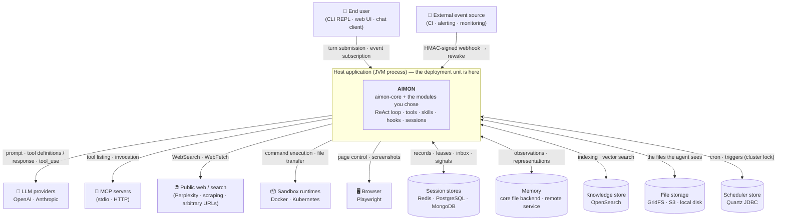

# Context & Scope

Defines the **boundary** of `aimon-core` — what sits inside this framework, what sits
outside it, and what is left if you remove one of the outside pieces.

- For the abstractions inside the boundary → [`architecture.en.md`](architecture.en.md)
- For a survey of what features exist → [`features.en.md`](features.en.md)
- For the picture once you run several nodes → [`deployment.en.md`](deployment.en.md)

---

## 1. The boundary is the **host application**, not the framework

IMPORTANT: `aimon-core` is **not a deployment unit.** It is neither a server nor a daemon;
it is a library that runs inside somebody else's application. So whenever you draw a box
labelled "the AIMON system", that box is always a **process the host owns**, and AIMON is
one lump inside it.

That fact settles every line of this document.

- **The host opens the process and the host closes it.** The core has no `main()` — the only
  ones are in `aimon-cli` and the sample apps, and both are assembly examples rather than
  framework.
- **Every connection to the outside is wired by the host.** The core does not discover LLM
  keys, DB connections or MCP server lists. They are injected through the spec objects of
  `aimon-bootstrap` (§4).
- **Most calls leaving the boundary are optional.** The core holds only interfaces and the
  implementations live outside it ([SOLID › DIP](../project/solid-principles.md)). That is
  why the table in §3 has a "without it" column.

---

## 2. Context diagram

Arrow direction is **who initiates the call**. Only two things come inward — a user
submitting a turn, and an external event's rewake webhook. Everything else is AIMON
reaching out.

---

## 3. What lives outside

The "without it" column is the point of this table. **Only the LLM provider is mandatory**;
the process starts with every other row missing.

| External system | What for | Direction | Module that attaches it | Without it |
|---|---|---|---|---|
| **LLM provider** | Every iteration of the ReAct loop | outbound (HTTPS) | `aimon-llm-openai` · `aimon-llm-anthropic` | **The loop does not run.** The core ships no `LlmClient` implementation |
| **Session store** | Records, leases, inbox, signals, idempotency | both ways | `aimon-session-{redis,postgres,mongodb}` | The in-memory defaults — single-node only, conversation lost on restart |
| **Memory** | Accumulating observations, promoting long-term memory | both ways | Built into the core (in-memory, `at.aimon.core.memory.file`); multiple instances need a remote `PeerMemory` backend — [aimon-memory](https://github.com/kangwoo/aimon-memory) | The memory feature is off |
| **Knowledge store** | RAG search, wiki | both ways | `aimon-knowledge-opensearch` | `KeywordKnowledgeStore` (core) gives keyword search only |
| **File storage** | The file world the agent sees | both ways | `aimon-filesystem-gridfs` · `aimon-filesystem-s3` | Local disk (`filesystem.impl.local`) |
| **Sandbox runtime** | Isolated command execution | outbound | `aimon-sandbox-docker` · `aimon-sandbox-kubernetes` | `LocalShell` — commands run with the host process's own privileges |
| **MCP server** | Joining external tools | outbound (stdio · HTTP) | core (`at.aimon.core.mcp`) | Built-in tools only |
| **Browser** | Web automation | outbound | `aimon-browser-playwright` | There is no `Browser` tool |
| **Public web / search** | `WebSearch` · `WebFetch` | outbound (HTTPS) | core (`at.aimon.core.tools.web`) | Those two tools fail. The SSRF guard is in the core |
| **Scheduler store** | The cluster lock and recovery for cron | both ways (JDBC) | `aimon-scheduling-quartz` | `InMemoryTaskScheduler` — on multiple nodes **cron fires once per node** |
| **External event source** | Waking an agent by webhook | **inbound** (HTTP) | `aimon-rewake-webhook` | The host has to wire rewake itself |

IMPORTANT (do not skim the sandbox row): leaving the sandbox module out does not **weaken**
isolation, it **removes** it. `Bash` runs with the host process's privileges. Tool permission
patterns (`Bash(git:*)`) only narrow **what the agent may ask for**; they do not create an
execution boundary — that distinction lives in the
[tool development guide › permission system](../features/tool/tool-development-guide.en.md).

---

## 4. The doors leading inward — three assembly entry points

There are three ways to take hold of AIMON from outside, and all three assemble the same core.

| Entry point | What it is | When |
|---|---|---|
| `aimon-bootstrap` (`AimonStack`) | Framework-neutral assembly plus ordered teardown | The default for embedding directly |
| `aimon-spring-boot-starter` | Autoconfiguration wrapped around the above | Spring Boot applications |
| `aimon-cli` | An interactive REPL | Development and demos — and the reference assembly |

All three **wire the same things**: they fill in spec objects (`LlmSpec`, `SessionSpec`,
`ToolSpec`, `SchedulingSpec`, `AgentSpec`, `ExecutorSpec`, …) and build an `AimonStack`. So
reading the CLI bootstrap also reads as the wiring for a web application —
[CLI integration reference](../getting-started/aimon-core-integration-via-cli-reference.en.md).

IMPORTANT (a trap in a name): `ExecutorSpec` is **not a thread-pool spec.** It is the
optional features of the ReAct executor (streaming · tracing · cost · memory). This
repository's rule applies here too — *do not infer a role from the last noun in a name*
([`scope-model.en.md` §5.2](scope-model.en.md)).

---

## 5. Out of scope — what AIMON does not do

Half of a boundary document is the list of things it **does not** do. Every row below is the
host's job, and designing on the expectation that the core will do it for you will not work out.

| Not done here | Whose job it is |
|---|---|
| **Authentication and authorization** | The host. The router accepts a `Principal` and carries it, nothing more — who may reach which session is decided by a layer above ([`routing.md` §1.2](../design/session/routing.md)) |
| **HTTP/WebSocket termination** | The host. There is no web server in the core (`aimon-rewake-webhook` is the one exception that opens its own port) |
| **Load balancing · service discovery** | Infrastructure. The routing design **rules out sticky routing explicitly** ([`deployment.en.md`](deployment.en.md)) |
| **Observability backends** | The host. The core holds only the `SpanExporter` · `SessionMetrics` interfaces |
| **UI rendering** | The host. What the core emits stops at the `AgentExecutionEvent` stream |
| **Secret management systems** | The host. The default `CredentialStore` implementation is in-memory |
| **Isolating the agent** | The sandbox modules (§3) |

---

## 6. Why there is no C4 container diagram

C4's container level draws units that are **deployed and run independently**. But as §1 showed,
AIMON is not a deployment unit — the host decides where the container boundary falls, and that
boundary differs for every embedding. Drawing an "AIMON container" would produce a picture that
fits no actual deployment.

So this repository splits that level in two directions instead.

| What you want to know | Document to read |
|---|---|
| What is outside and what is mandatory | **This document** (C4 L1 = arc42 §3) |
| What runs where and what is shared once you run several nodes | [`deployment.en.md`](deployment.en.md) (arc42 §7) |
| How the process is divided up inside | [`architecture.en.md`](architecture.en.md) §2 · §3 — and those rules are **enforced by ArchUnit**, not by a picture |

That last row is also why there is no component-level (C4 L3) diagram. The package dependency
rules already exist in a form that breaks the build, so redrawing them as a picture would only
buy them the freedom to drift from the code.

---

## Related documents

- [`architecture.en.md`](architecture.en.md) — the core abstractions **inside** the boundary
- [`deployment.en.md`](deployment.en.md) — the multi-node deployment view
- [`features.en.md`](features.en.md) — the feature catalogue (each row marked core or module)
- [`glossary.en.md`](glossary.en.md) — terms and their lifetimes
- [`../getting-started/embedding-agent-in-application.en.md`](../getting-started/embedding-agent-in-application.en.md) — how to actually attach it
