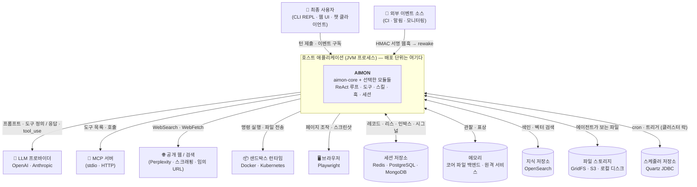

# 시스템 컨텍스트 (Context & Scope)

`aimon-core` 의 **경계**를 정의한다 — 무엇이 이 프레임워크 안에 있고, 무엇이 바깥에 있으며,
바깥의 것 하나를 빼면 무엇이 남는가.

- 안쪽의 추상화가 궁금하면 → [`architecture.md`](architecture.md)
- 무슨 기능이 있는지 훑고 싶으면 → [`features.md`](features.md)
- 여러 노드로 띄웠을 때의 그림은 → [`deployment.md`](deployment.md)

---

## 1. 경계는 프레임워크가 아니라 **호스트 애플리케이션**이다

IMPORTANT: `aimon-core` 는 **배포 단위가 아니다.** 서버도 데몬도 아니고, 남의 애플리케이션 안에서
도는 라이브러리다. 따라서 "AIMON 시스템" 이라는 상자를 그리면 그 상자는 언제나 **호스트가 소유한
프로세스**이고, AIMON 은 그 안의 한 덩어리다.

이 사실이 이 문서의 모든 줄을 정한다.

- **프로세스를 여는 것도 닫는 것도 호스트다.** 코어에는 `main()` 이 없다 — 있는 것은
  `aimon-cli` 와 샘플 앱뿐이고, 둘 다 프레임워크가 아니라 조립 예시다.
- **바깥과의 연결은 전부 호스트가 결선한다.** LLM 키, DB 커넥션, MCP 서버 목록은 코어가 발견하지
  않는다. `aimon-bootstrap` 의 스펙 객체로 주입받는다 (§4).
- **경계 밖으로 나가는 호출의 대부분은 선택적이다.** 코어는 인터페이스만 갖고 구현이 밖에 있다
  ([SOLID › DIP](../project/solid-principles.md)). 그래서 §3 의 표에 "없으면 어떻게 되나" 열이 있다.

---

## 2. 컨텍스트 다이어그램

화살표 방향은 **누가 호출을 시작하는가**다. 안으로 들어오는 것은 둘뿐이다 — 사용자의 턴 제출과
외부 이벤트의 rewake 웹훅. 나머지는 전부 AIMON 이 나간다.

---

## 3. 바깥에 있는 것들

"없으면 어떻게 되나" 열이 이 표의 핵심이다. **필수는 LLM 프로바이더 하나뿐**이고, 나머지는
전부 빠진 채로도 프로세스가 뜬다.

| 외부 시스템 | 무엇을 위해 | 방향 | 붙이는 모듈 | 없으면 |
|---|---|---|---|---|
| **LLM 프로바이더** | ReAct 루프의 매 iteration | 나감 (HTTPS) | `aimon-llm-openai` · `aimon-llm-anthropic` | **루프가 돌지 않는다.** 코어에는 `LlmClient` 구현이 없다 |
| **세션 저장소** | 레코드·리스·인박스·시그널·idempotency | 양방향 | `aimon-session-{redis,postgres,mongodb}` | in-memory 기본 구현 — 단일 노드 전용, 재시작 시 대화 소실 |
| **메모리** | 관찰 축적과 장기 기억 승격 | 양방향 | 코어 내장(in-memory · `at.aimon.core.memory.file`), 멀티 인스턴스는 원격 `PeerMemory` 백엔드 — [aimon-memory](https://github.com/kangwoo/aimon-memory) | 메모리 기능이 꺼진다 |
| **지식 저장소** | RAG 검색, 위키 | 양방향 | `aimon-knowledge-opensearch` | `KeywordKnowledgeStore` (코어) 로 키워드 검색만 |
| **파일 스토리지** | 에이전트가 보는 파일 세계 | 양방향 | `aimon-filesystem-gridfs` · `aimon-filesystem-s3` | 로컬 디스크 (`filesystem.impl.local`) |
| **샌드박스 런타임** | 격리된 명령 실행 | 나감 | `aimon-sandbox-docker` · `aimon-sandbox-kubernetes` | `LocalShell` — 호스트 프로세스 권한으로 그대로 실행된다 |
| **MCP 서버** | 외부 도구 합류 | 나감 (stdio · HTTP) | core (`at.aimon.core.mcp`) | 내장 도구만 |
| **브라우저** | 웹 자동화 | 나감 | `aimon-browser-playwright` | `Browser` 도구가 없다 |
| **공개 웹 / 검색** | `WebSearch` · `WebFetch` | 나감 (HTTPS) | core (`at.aimon.core.tools.web`) | 그 두 도구가 실패한다. SSRF 가드는 코어에 있다 |
| **스케줄러 저장소** | cron 의 클러스터 락과 복구 | 양방향 (JDBC) | `aimon-scheduling-quartz` | `InMemoryTaskScheduler` — 멀티 노드면 **cron 이 노드마다 중복 발화** |
| **외부 이벤트 소스** | 웹훅으로 에이전트 깨우기 | **들어옴** (HTTP) | `aimon-rewake-webhook` | rewake 를 호스트가 직접 결선해야 한다 |

IMPORTANT (샌드박스 줄을 흘려 읽지 말 것): 샌드박스 모듈을 붙이지 않으면 격리가 **약해지는 것이
아니라 없다.** `Bash` 는 호스트 프로세스의 권한으로 실행된다. 도구 권한 패턴
(`Bash(git:*)`)은 에이전트가 **무엇을 요청할 수 있는지**를 좁힐 뿐 실행 경계를 만들지 않는다 —
그 구분은 [도구 개발 가이드 › 권한 시스템](../features/tool/tool-development-guide.md) 에 있다.

---

## 4. 안쪽으로 들어오는 문 — 조립 진입점 셋

바깥에서 AIMON 을 붙잡는 방법은 셋이고, 셋 다 같은 코어를 조립한다.

| 진입점 | 무엇인가 | 언제 |
|---|---|---|
| `aimon-bootstrap` (`AimonStack`) | 프레임워크 중립 조립 + 순서 있는 teardown | 직접 임베딩할 때의 기본 |
| `aimon-spring-boot-starter` | 위를 감싼 자동설정 | Spring Boot 애플리케이션 |
| `aimon-cli` | 대화형 REPL | 개발·시연, 그리고 조립 참조 구현 |

셋 다 **같은 것을 결선한다** — 스펙 객체(`LlmSpec`, `SessionSpec`, `ToolSpec`, `SchedulingSpec`,
`AgentSpec`, `ExecutorSpec` …)를 채워 `AimonStack` 을 만든다. 그래서 CLI 부트스트랩을 읽으면
웹 애플리케이션의 결선도 읽힌다 —
[CLI 통합 레퍼런스](../getting-started/aimon-core-integration-via-cli-reference.md).

IMPORTANT (이름의 함정): `ExecutorSpec` 은 **스레드풀 스펙이 아니다.** ReAct 실행기의 선택 기능
(streaming · tracing · cost · memory)이다. 이 저장소의 규칙이 여기서도 걸린다 — *이름의 마지막
명사로 역할을 추론하지 말 것* ([`scope-model.md` §5.2](scope-model.md)).

---

## 5. 범위 밖 — AIMON 이 하지 않는 것

경계 문서의 절반은 **안 하는 것**의 목록이다. 아래는 전부 호스트의 일이며, 코어가 대신 해 주기를
기대하고 설계하면 어긋난다.

| 하지 않는 것 | 누구의 일인가 |
|---|---|
| **인증·인가** | 호스트. 라우터는 `Principal` 을 받아 나르기만 한다 — 누가 어느 세션에 접근할 수 있는지는 상위 계층이 정한다 ([`routing.md` §1.2](../design/session/routing.md)) |
| **HTTP/WebSocket 종단** | 호스트. 코어에 웹 서버가 없다 (`aimon-rewake-webhook` 만 예외적으로 자기 포트를 연다) |
| **로드밸런싱 · 서비스 디스커버리** | 인프라. 라우팅 설계는 **sticky 를 명시적으로 배제**한다 ([`deployment.md`](deployment.md)) |
| **관측 백엔드** | 호스트. 코어는 `SpanExporter` · `SessionMetrics` 인터페이스만 갖는다 |
| **UI 렌더링** | 호스트. 코어가 내보내는 것은 `AgentExecutionEvent` 스트림까지다 |
| **시크릿 관리 시스템** | 호스트. `CredentialStore` 의 기본 구현은 in-memory 다 |
| **에이전트의 격리** | 샌드박스 모듈 (§3) |

---

## 6. 왜 C4 컨테이너 다이어그램이 없는가

C4 의 컨테이너 레벨은 **독립적으로 배포·실행되는 단위**를 그린다. 그런데 §1 에서 본 대로 AIMON 은
배포 단위가 아니다 — 컨테이너 경계를 정하는 것은 호스트이고, 그 경계는 임베딩하는 쪽마다 다르다.
"AIMON 컨테이너" 를 그리면 그 그림은 어느 배포에도 맞지 않는다.

그래서 이 저장소는 그 레벨을 두 방향으로 나눠 가진다.

| 알고 싶은 것 | 보는 문서 |
|---|---|
| 무엇이 바깥에 있고 무엇이 필수인가 | **이 문서** (C4 L1 = arc42 §3) |
| 여러 노드로 띄우면 무엇이 어디에 뜨고 무엇이 공유되는가 | [`deployment.md`](deployment.md) (arc42 §7) |
| 프로세스 안의 덩어리 구분 | [`architecture.md`](architecture.md) §2·§3 — 그리고 그 규칙은 그림이 아니라 **ArchUnit 이 강제한다** |

마지막 줄이 컴포넌트 레벨(C4 L3)을 그리지 않는 이유이기도 하다. 패키지 의존 규칙은 이미
빌드가 깨뜨리는 형태로 존재하므로, 같은 것을 그림으로 옮기면 코드와 어긋날 자유만 생긴다.

---

## 관련 문서

- [`architecture.md`](architecture.md) — 경계 **안쪽**의 핵심 추상화
- [`deployment.md`](deployment.md) — 멀티 노드 배포 뷰
- [`features.md`](features.md) — 기능 카탈로그 (모듈별 위치 표기)
- [`glossary.md`](glossary.md) — 용어와 수명 사전
- [`../getting-started/embedding-agent-in-application.md`](../getting-started/embedding-agent-in-application.md) — 실제로 붙이는 절차
