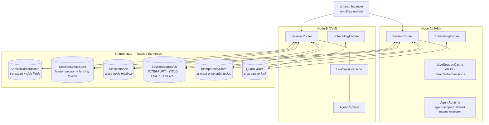
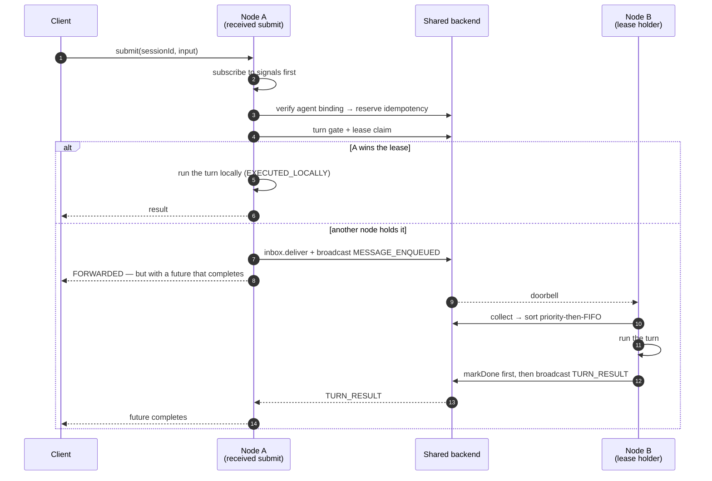

# Deployment View

Draws **what runs where** once an application embedding AIMON is actually deployed. The
boundary between what stays inside a node and what has to leave it is the whole of this document.

- For what lives outside the boundary first → [`context.en.md`](context.en.md)
- For lifetime and ownership rules → [`scope-model.en.md`](scope-model.en.md)
- For wiring steps and operational tunables → the
  [web session deployment guide](../features/session/web-session-deployment-guide.en.md) ·
  [Quartz deployment guide](../features/scheduling/quartz-scheduling-web-deployment-guide.en.md)

---

## 1. Two topologies, one switch

`DeploymentMode` is that switch.

| | `SINGLE_NODE` | `DISTRIBUTED` |
|---|---|---|
| When | One process | Two or more instances behind a load balancer |
| The four session SPIs | in-memory defaults | **all must be wired explicitly** |
| Scheduler | `InMemoryTaskScheduler` | `QuartzTaskScheduler` (JDBC + clustered) |
| On restart | Depends on the stores you wired | Another node takes over |

IMPORTANT: `DISTRIBUTED` **fails fast** at `build()` if even one SPI is missing. Falling back
leniently to in-memory would produce a **silent split-brain** in which two nodes process the
same session side by side. For the same reason `nodeId` must be unique per process — it is
embedded verbatim in lease holder identity, idempotency entries and signal-bus origin filters,
so a duplicate makes a node **mistake its own signal for a peer's and wait for itself.**

---

## 2. Multi-node deployment

The five shared boxes **may share one backend or be split across several.** All three modules
(`aimon-session-{redis,postgres,mongodb}`) implement all five, so which one to pick is answered
by the table in [`backends.md` §7](../design/session/backends.md). Using what you already
operate is the first criterion.

---

## 3. What is node-local and what is shared

This table is what deployments get wrong most often.

| | Node-local — dies with the process | Shared — behind an SPI |
|---|---|---|
| **What** | `LiveSession`, event publishers, cache entries, lease renewal schedules, in-flight turn state | Records, leases, inbox, signals, the idempotency ledger |
| **The router's role** | Creates and closes them | Reads and writes them — it does **not own** them |
| **If the node dies** | Gone | Still there |

Three consequences follow.

- **`AgentRuntime` does not belong to the router.** It is agent-scoped and lives across sessions.
  Neither `SessionRouter.close()` nor `LiveSession.close()` closes it — that is the bootstrap's job.
- **In-flight turn state dies with the node.** Which is why no partial state is committed
  mid-turn, and why a separate path exists to detect holder loss and tell subscribers via
  `InterruptedAt(HOLDER_LOST)`.
- **Everything crossing a node boundary is a JSON primitive.** Signal payloads are unpacked into
  a `LinkedHashMap` and never restored into typed objects. Code that ships a typed object and
  receives it with `instanceof` works only on the in-process bus and becomes a **silent no-op**
  on a real one.

---

## 4. Sticky routing is not used — that is an explicit exclusion

Not because it is unavailable, but because the **1 : 0..N asymmetry makes it unnecessary**.
Only `SessionRecord` is persistent and `LiveSession` is a node-local handle
([`scope-model.en.md` §3](scope-model.en.md)), so whichever node serves the turn, the authority
is the record.

In exchange, two things are accepted.

| What is accepted | Why it is fine |
|---|---|
| Handles for the same session may **exist on two nodes at once** | The authority for history is `SessionRecordStore`. `TranscriptManager.initialize` re-reads from the record at the start of every turn, so no turn starts from a stale copy |
| Duplicated handles duplicate resources such as MCP clients | The idle TTL (10 minutes by default) cleans them up |

**Turn execution itself is serialized by the lease** — turns for one `SessionId` run one at a
time across the whole cluster. Allowing duplicate handles while blocking only execution is the
point of this design.

---

## 5. The path one turn takes

Two branches, depending on whether the node that received the submission is the holder.
**The caller cannot tell them apart** — either way it gets a future that completes.

`markDone` coming **before** the broadcast is the crux — for a node that missed the broadcast
the authority is the store, and in the reverse order there would be nothing for it to read back.
A missed broadcast still resolves through the idempotency-store polling fallback, but that is
the slow path.

---

## 6. What happens when something breaks

| Event | Result |
|---|---|
| **Node down** | The lease expires on its TTL. The cache and the in-flight turn are lost. If the inbox is on a distributed backend, delivered messages survive for another node to collect |
| **Lease renewal fails** | The in-flight turn takes `interrupt(LEASE_LOST)`. No partial state is committed |
| **`claim` fails** | `submit` fails. The web adapter maps it to 503 and the caller retries |
| **Pub/sub disconnect** | Signals sent during the gap are lost. Resubscribes on reconnect. The Postgres and Mongo backends can read the backlog back |
| **Split-brain** | Fencing tokens filter it out at the write step. Holding leases briefly and aborting immediately on renewal failure narrows the window |
| **Permanent backend loss** | Every in-flight turn aborts. If `SessionRecordStore` is on a separate backend, history survives |

Configure the lease and signal backends for **HA**. A brief wobble in the others and a wobble
in these two do not have the same blast radius.

---

## 7. Deployment checklist

What to verify when moving from a single node to a cluster. The basis for each row is on the right.

| Check | Basis |
|---|---|
| Switched to `DeploymentMode.DISTRIBUTED` and wired all four SPIs | [web session deployment guide §1](../features/session/web-session-deployment-guide.en.md) |
| `nodeId` unique per process (`HOSTNAME` or similar) | same guide §1 |
| `lockExtendInterval < lockLease` — enforced at `build()` | same guide §3 |
| `idempotencySecondaryTtl > lockLease` — violating it causes false holder-loss on healthy nodes | same guide §3 |
| Scheduler switched to `QuartzTaskScheduler` (JDBC + clustered) | [Quartz guide §3](../features/scheduling/quartz-scheduling-web-deployment-guide.en.md) |
| Quartz table schema applied and **NTP** synchronized across nodes | same guide §3.1 · §6.1 |
| `AgentRuntimeRegistry` **created outside** and injected as the same instance into both scheduling and sessions | same guide §2 |
| If you use `SessionApprovalStore`, the **same instance** passed to both the runtime and the router | [web session deployment guide §1](../features/session/web-session-deployment-guide.en.md) |
| One `SessionMetrics` implementation wired per process | same guide §4 |
| Graceful shutdown hooked into container termination | same guide §5 |

IMPORTANT (one silent failure): if `AgentRuntimeRegistry` is not injected,
`SchedulingEngineBuilder` builds its own. **No exception is thrown.** The runtimes the bootstrap
registered are not in that registry, so it only surfaces when the cron fires, as
`IllegalStateException("No agent runtime registered for binding: …")`.

---

## 8. Scheduling is a different axis from sessions

They deploy together but their lifetimes differ. `SchedulingEngine` · `ScheduledTaskManager` ·
`RoutineExecutor` are **application-scoped** and must stay alive after a live session closes.

That is why `ScheduledTask.boundRuntimeId` references an **agent-scoped** id
(`agent:<name>[:<discriminator>]`) — the runtime still resolves from the registry when cron
re-fires long after the original session ended. Minting a fresh `AgentRuntimeId` per execution
collapses this path entirely, which is why `generate()` does not exist at all
([`scope-model.en.md` §4](scope-model.en.md)).

---

## Related documents

- [`context.en.md`](context.en.md) — the system boundary and the external systems
- [`scope-model.en.md`](scope-model.en.md) — lifetime, ownership and teardown responsibility
- [web session deployment guide](../features/session/web-session-deployment-guide.en.md) — wiring code, tunables, operational playbook
- [Quartz deployment guide](../features/scheduling/quartz-scheduling-web-deployment-guide.en.md) — clustered scheduling
- [`routing.md`](../design/session/routing.md) — the routing design rationale and the alternatives rejected
- [`backends.md`](../design/session/backends.md) — the schemas and guarantee differences of the three backends
