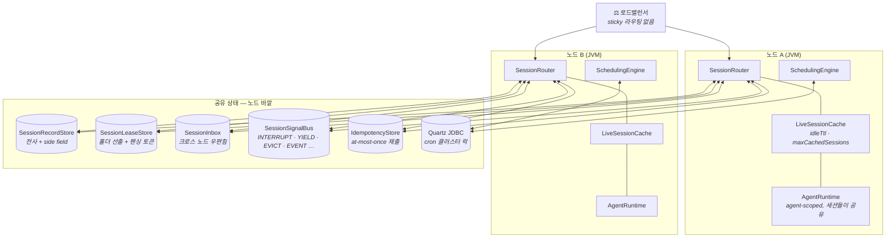
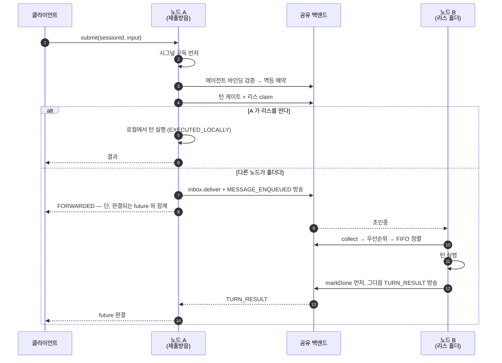

# 배포 뷰 (Deployment View)

AIMON 을 임베딩한 애플리케이션을 **실제로 띄웠을 때 무엇이 어디에 있는가**를 그린다. 노드 안에
남는 것과 노드 밖으로 나가야 하는 것의 경계가 이 문서의 전부다.

- 바깥에 무엇이 있는지부터 → [`context.md`](context.md)
- 수명·소유권 규칙 → [`scope-model.md`](scope-model.md)
- 결선 절차와 운영 튜너블 → [웹 세션 배포 가이드](../features/session/web-session-deployment-guide.md) ·
  [Quartz 배포 가이드](../features/scheduling/quartz-scheduling-web-deployment-guide.md)

---

## 1. 토폴로지는 둘이고, 스위치는 하나다

`DeploymentMode` 가 그 스위치다.

| | `SINGLE_NODE` | `DISTRIBUTED` |
|---|---|---|
| 언제 | 프로세스가 하나일 때 | 로드밸런서 뒤에 인스턴스가 2개 이상 |
| 세션 SPI 넷 | in-memory 기본값 | **전부 명시 결선 필수** |
| 스케줄러 | `InMemoryTaskScheduler` | `QuartzTaskScheduler` (JDBC + clustered) |
| 재시작하면 | 결선한 저장소에 달림 | 다른 노드가 이어받는다 |

IMPORTANT: `DISTRIBUTED` 는 SPI 를 하나라도 빠뜨리면 `build()` 에서 **fail-fast** 한다. 관대하게
in-memory 로 대체하면 두 노드가 같은 세션을 나란히 처리하는 **조용한 split-brain** 이 되기 때문이다.
같은 이유로 `nodeId` 는 프로세스마다 유일해야 한다 — 리스 홀더 신원·멱등 항목·시그널 출처 필터에
그대로 박히므로, 겹치면 노드가 **자기 신호를 남의 것으로 착각하고 스스로를 기다린다.**

---

## 2. 멀티 노드 배포

공유 상자 다섯은 **한 백엔드에 몰아도 되고 갈라도 된다.** Redis · PostgreSQL · MongoDB 세 모듈이
각각 다섯을 전부 구현하므로(`aimon-session-{redis,postgres,mongodb}`), 어느 것을 고를지는
[`backends.md` §7](../design/session/backends.md) 의 표가 답한다. 이미 운영 중인 것을 쓰는 것이
첫 번째 기준이다.

---

## 3. 무엇이 노드 로컬이고 무엇이 공유인가

이 표가 배포에서 가장 자주 틀리는 자리다.

| | 노드 로컬 — 프로세스와 함께 죽는다 | 공유 — SPI 뒤에 있다 |
|---|---|---|
| **무엇** | `LiveSession`, 이벤트 publisher, 캐시 항목, 리스 갱신 스케줄, 진행 중 턴의 상태 | 레코드, 리스, 인박스, 시그널, 멱등 원장 |
| **라우터의 역할** | 만들고 닫는다 | 읽고 쓴다 — **소유하지 않는다** |
| **노드가 죽으면** | 사라진다 | 남는다 |

여기서 세 가지가 따라 나온다.

- **`AgentRuntime` 은 라우터의 것이 아니다.** agent-scoped 이고 세션들을 가로질러 산다.
  `SessionRouter.close()` 도 `LiveSession.close()` 도 그것을 닫지 않는다 — 닫는 것은 부트스트랩의 일이다.
- **진행 중 턴의 상태는 노드와 함께 죽는다.** 그래서 턴 도중 partial state 를 커밋하지 않고,
  홀더 유실을 감지해 구독자에게 `InterruptedAt(HOLDER_LOST)` 로 알리는 경로가 따로 있다.
- **크로스 노드로 나가는 것은 전부 JSON 원시값이다.** 시그널 페이로드는 `LinkedHashMap` 으로 풀릴 뿐
  타입 객체로 복원되지 않는다. 타입 객체를 실어 보내고 `instanceof` 로 받는 코드는 in-process 버스에서만
  동작하고 실제 버스에서는 **조용한 no-op** 이 된다.

---

## 4. sticky 라우팅을 쓰지 않는다 — 명시적 배제다

가능해서가 아니라 **1 : 0..N 비대칭 덕분에 필요가 없어서**다. `SessionRecord` 만 영속이고
`LiveSession` 은 노드 로컬 핸들이므로([`scope-model.md` §3](scope-model.md)), 어느 노드가 서빙하든
권위는 레코드에 있다.

그 대가로 두 가지를 받아들인다.

| 받아들이는 것 | 왜 괜찮은가 |
|---|---|
| 같은 세션의 핸들이 **두 노드에 동시에 존재**할 수 있다 | 이력의 권위는 `SessionRecordStore` 다. 매 턴 시작 시 `TranscriptManager.initialize` 가 레코드에서 다시 읽으므로, 낡은 사본으로 턴이 시작되지 않는다 |
| 중복된 핸들만큼 MCP 클라이언트 등의 자원이 겹친다 | idle TTL(기본 10분)이 정리한다 |

**턴 실행 자체는 리스로 직렬화**한다 — 같은 `SessionId` 의 턴은 전 클러스터에서 한 번에 하나다.
핸들 중복은 허용하고 실행만 막는 것이 이 설계의 요지다.

---

## 5. 턴 하나가 도는 길

제출을 받은 노드가 홀더인지 아닌지에 따라 두 갈래다. **호출자에게는 둘이 구분되지 않는다** —
어느 쪽이든 완결되는 future 를 받는다.

`markDone` 이 방송보다 **먼저**인 것이 핵심이다 — 방송을 놓친 노드에게 권위는 스토어이고,
순서가 거꾸로면 놓친 노드가 되읽을 것이 없다. 방송을 놓쳐도 멱등 저장소 폴링 fallback 이 같은
일을 하지만 그쪽은 느린 길이다.

---

## 6. 무엇이 깨지면 무엇이 일어나는가

| 사건 | 결과 |
|---|---|
| **노드 다운** | 리스가 TTL 로 풀린다. 캐시와 진행 중 턴은 손실. inbox 가 분산 백엔드면 배달된 메시지는 살아남아 다른 노드가 collect 한다 |
| **리스 갱신 실패** | 진행 중 턴이 `interrupt(LEASE_LOST)`. partial state 는 커밋되지 않는다 |
| **`claim` 실패** | `submit` 실패. 웹 어댑터가 503 으로 매핑하고 재시도 |
| **pub/sub 끊김** | 끊긴 동안의 신호 손실. 재연결 후 재구독. Postgres·Mongo 백엔드는 백로그를 되읽을 수 있다 |
| **Split-brain** | 펜싱 토큰이 write 단계에서 걸러 낸다. 리스를 짧게 잡고 갱신 실패 시 즉시 중단하면 창이 좁아진다 |
| **백엔드 영구 손실** | 모든 in-flight 턴 중단. `SessionRecordStore` 가 별도 백엔드면 이력은 보존된다 |

리스·시그널 백엔드는 **HA 로 구성한다.** 나머지가 잠깐 흔들리는 것과 이 둘이 흔들리는 것은
영향 범위가 다르다.

---

## 7. 배포 체크리스트

단일 노드에서 클러스터로 넘어갈 때 확인할 것. 각 줄의 근거는 오른쪽 문서에 있다.

| 확인 | 근거 |
|---|---|
| `DeploymentMode.DISTRIBUTED` 로 바꾸고 SPI 넷을 전부 결선했는가 | [웹 세션 배포 가이드 §1](../features/session/web-session-deployment-guide.md) |
| `nodeId` 가 프로세스마다 유일한가 (`HOSTNAME` 등) | 같은 가이드 §1 |
| `lockExtendInterval < lockLease` — `build()` 가 강제한다 | 같은 가이드 §3 |
| `idempotencySecondaryTtl > lockLease` — 어기면 건강한 노드에서 홀더 유실 오탐 | 같은 가이드 §3 |
| 스케줄러를 `QuartzTaskScheduler`(JDBC + clustered)로 바꿨는가 | [Quartz 가이드 §3](../features/scheduling/quartz-scheduling-web-deployment-guide.md) |
| Quartz 테이블 스키마를 적용하고 노드 간 **NTP** 를 맞췄는가 | 같은 가이드 §3.1 · §6.1 |
| `AgentRuntimeRegistry` 를 **밖에서 만들어** 스케줄링과 세션 양쪽에 같은 인스턴스로 주입했는가 | 같은 가이드 §2 |
| `SessionApprovalStore` 를 쓴다면 런타임과 라우터에 **같은 인스턴스**를 넘겼는가 | [웹 세션 배포 가이드 §1](../features/session/web-session-deployment-guide.md) |
| `SessionMetrics` 구현을 프로세스당 하나 결선했는가 | 같은 가이드 §4 |
| graceful shutdown 을 컨테이너 종료 훅에 연결했는가 | 같은 가이드 §5 |

IMPORTANT (조용한 실패 하나): `AgentRuntimeRegistry` 를 주입하지 않으면 `SchedulingEngineBuilder` 가
자기 것을 만들어 쓴다. **예외가 나지 않는다.** 부트스트랩이 등록한 런타임이 그 레지스트리에는 없으므로,
cron 이 발화할 때가 되어서야 `IllegalStateException("No agent runtime registered for binding: …")` 로
드러난다.

---

## 8. 스케줄링은 세션과 다른 축이다

같이 배포되지만 수명이 다르다. `SchedulingEngine` · `ScheduledTaskManager` · `RoutineExecutor` 는
**application-scoped** 이고, 라이브 세션이 닫혀도 살아 있어야 한다.

`ScheduledTask.boundRuntimeId` 가 **agent-scoped** id (`agent:<name>[:<discriminator>]`) 를 참조하는
이유가 이것이다 — 원래 세션이 끝난 한참 뒤에 cron 이 재발화해도 레지스트리에서 런타임이 resolve 된다.
`AgentRuntimeId` 를 실행마다 새로 만들면 이 경로가 통째로 무너진다. 그래서 `generate()` 가 아예
존재하지 않는다 ([`scope-model.md` §4](scope-model.md)).

---

## 관련 문서

- [`context.md`](context.md) — 시스템 경계와 외부 시스템
- [`scope-model.md`](scope-model.md) — 수명·소유권·소멸 책임
- [웹 세션 배포 가이드](../features/session/web-session-deployment-guide.md) — 결선 코드, 튜너블, 운영 플레이북
- [Quartz 배포 가이드](../features/scheduling/quartz-scheduling-web-deployment-guide.md) — 클러스터 스케줄링
- [`routing.md`](../design/session/routing.md) — 라우팅 설계 근거와 기각한 대안
- [`backends.md`](../design/session/backends.md) — 세 백엔드의 스키마와 보장 차이
